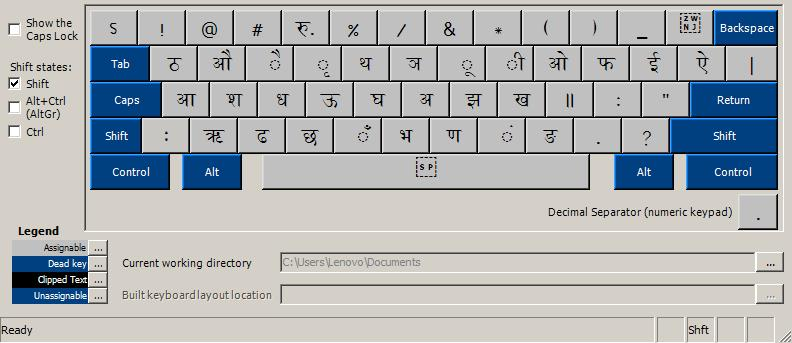
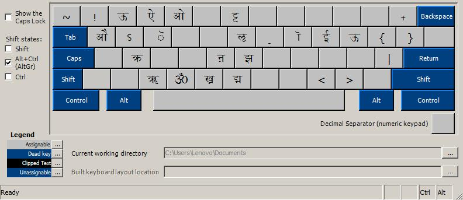

# Nepali Unicode Romanised keyboard layout for Windows

I was unable to install Nepali Unicode Romanised on a Windows 10 from Microsoft directly. For some reason, keyboard layout from MPP, which has been working in my Windows 7 since late 2000s did not work on Windows 10. I resorted to using Microsoft's Keyboard Layout Creator 1.4 to import the Nepali Unicode Romanised standard keyboard layout and create installer files. Installer files are under np_roman folder.

## License

Program distributed under the terms of the [MIT license](https://github.com/asheshwor/nepali/blob/master/LICENSE).

See individual licenses for external data/tools used if any.
